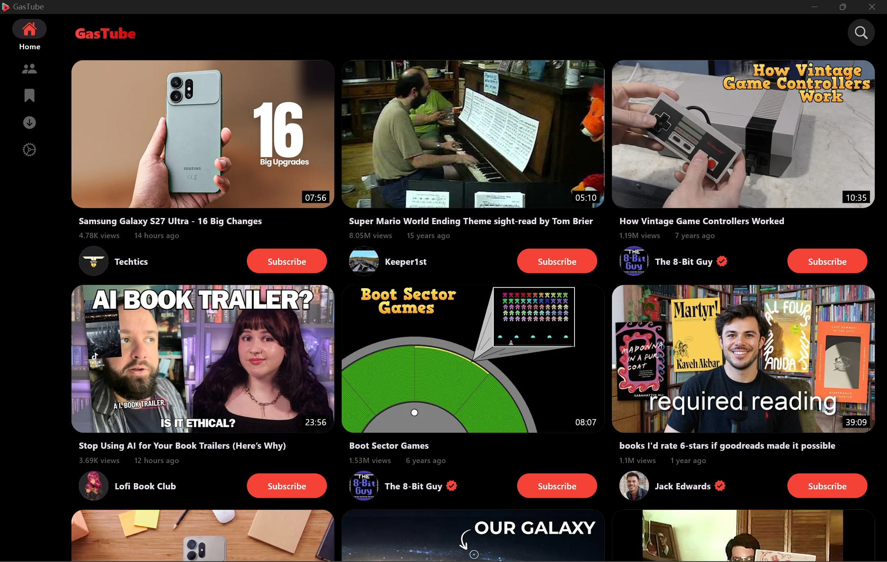
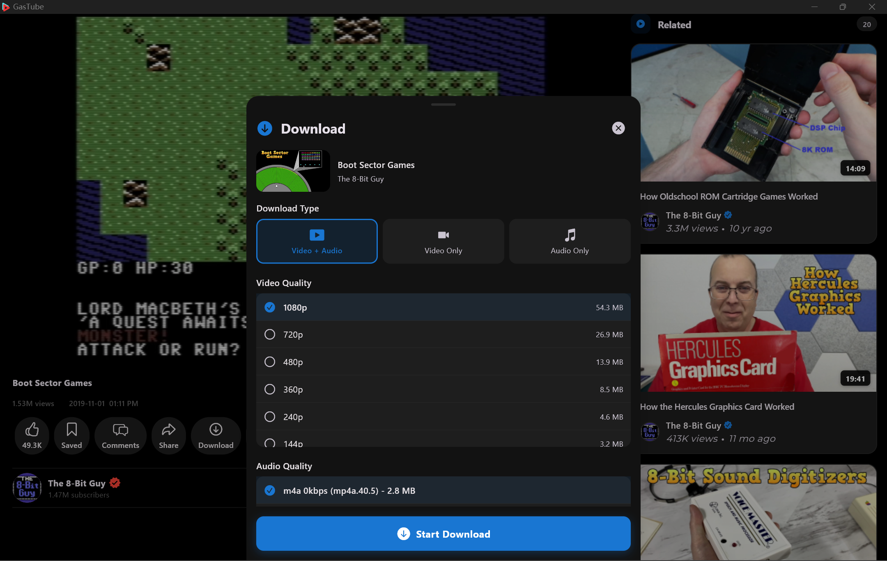

# GasTube


GasTube is a GPL-3.0 fork of [FluxTube](https://github.com/alpha-liu-01/GasTube) by Muhammed Fazil vk. It is an ad-free YouTube client for Android, Windows, and Linux. Watch videos without ads, subscribe to channels, retrieve video dislikes, read comments, save videos, and more.

GasTube is not an official FluxTube release.

<p align="center">
<a href="https://github.com/alpha-liu-01/GasTube/releases" alt="FluxTube GitHub release"></a>
<a href="https://www.gnu.org/licenses/gpl-3.0.en.html" alt="GPL v3"></a>
  <a href="https://github.com/alpha-liu-01/GasTube" alt="Flutter"></a>
  <a href="https://github.com/alpha-liu-01/GasTube/releases" alt="GasTube downloads"></a>
</p>

The release and download badges above are for FluxTube, the upstream project. They are not GasTube downloads.

## Features

- **No Login Needed**: Use the app without any login requirements.
- **Ad-Free Experience**: Enjoy YouTube videos without interruptions.
- **Multiple YouTube Services**: Switch between NewPipe Extractor, Piped, Invidious, or Explode backends.
- **Download Videos**: Download videos and audio in multiple qualities with FFmpeg merging support.
- **Background Playback**: Continue listening with notification controls (play/pause/seek).
- **Picture-in-Picture**: System PiP mode - auto-enters when pressing home while playing.
- **SponsorBlock**: Auto-skip sponsored segments, intros, outros, and more.
- **Multiple Profiles**: Separate subscriptions, history, and saved videos per profile.
- **Channel Subscriptions**: Subscribe to your favorite channels.
- **Dislike Retrieval**: See the number of dislikes on videos.
- **Comment Section**: Read video comments and replies.
- **Save Videos**: Save videos to watch later with search and sorting.
- **Deep Linking**: Open YouTube links directly in GasTube.
- **NewPipe-Compatible Backup**: Import/export data as NewPipe-compatible ZIP files.
- **Select Your Region**: Customize the content based on your region.
- **Multi-Language Support**: 12+ languages supported.
- **Watch live streams**: Enjoy live content.
- **Video Fit Modes**: Contain, cover, fill, fit-width, fit-height.
- **Customizable Skip Interval**: Double-tap to skip 5-60 seconds.
- **Watch Videos up to 4K Quality**: Enjoy videos in high quality up to 4K resolution.
- **Distraction-Free Mode**: Hide comments and related videos.
- **Desktop and wide windows**: On Windows and Linux, a wide window uses a side rail, multi-column cards, and a split watch page.

###### Note:

Some features are only available when using the NewPipe Extractor service.

## Screenshots

<div align="center">
  
  
  
  
</div>

## Download

FluxTube's Android releases stay with the original project:

<p>
  <a href="https://github.com/alpha-liu-01/GasTube/releases">
    
  </a>
</p>

<p>
  <a href="https://apt.izzysoft.de/packages/com.fazilvk.fluxtube">
    
  </a>
</p>

Those links install FluxTube (`com.fazilvk.fluxtube`), not GasTube. GasTube source for this fork is [alpha-liu-01/FluxTube](https://github.com/alpha-liu-01/FluxTube).

## NewPipe, FluxTube, and GasTube

If you select "NewPipe Extractor" as your YouTube service in FluxTube or GasTube, it uses the same [NewPipe Extractor](https://github.com/TeamNewPipe/NewPipeExtractor) library as the NewPipe app.

|                             | NewPipe App                                        | FluxTube                                           | GasTube                                            |
| --------------------------- | -------------------------------------------------- | -------------------------------------------------- | -------------------------------------------------- |
| **Framework**               | Native Android (Kotlin/Java)                       | Flutter                                            | Flutter                                            |
| **Platforms**               | Android                                            | Android                                            | Android, Windows, and Linux                        |
| **Multiple Backends**       | No (NewPipe Extractor only)                        | Yes (NewPipe Extractor, Piped, Invidious, Explode) | Yes (NewPipe Extractor, Piped, Invidious, Explode) |
| **Fallback Options**        | Wait for app update                                | Switch service if one breaks                       | Switch service if one breaks                       |
| **SponsorBlock**            | Requires fork (e.g., Tubular)                      | Built-in                                           | Built-in                                           |
| **Multiple Profiles**       | No                                                 | Yes                                                | Yes                                                |
| **Download**                | Yes                                                | Yes (all services, with FFmpeg merging)            | Yes (all services, with FFmpeg merging)            |
| **Background Play**         | Yes (with notification controls)                   | Yes (with notification controls)                   | Yes (with notification controls)                   |
| **System PiP**              | Yes                                                | Yes (auto-enter on home press)                     | Yes (auto-enter on home press)                     |
| **Wide window**             | No                                                 | No                                                 | Side rail, multi-column cards, split watch page    |

**TL;DR:** FluxTube and GasTube keep multiple backends, so a broken NewPipe Extractor can fall back to Piped or Invidious. NewPipe is the native Android app with one backend. GasTube is the FluxTube fork that also ships Windows and Linux builds and lays out a wide window as a tablet.

## Recommended Settings

For the best experience:

| Use Case                                | YouTube Service    | Notes                                                 |
| --------------------------------------- | ------------------ | ----------------------------------------------------- |
| **Recommended**                         | NewPipe Extractor  | Direct extraction, most reliable, no instances needed |
| **When NewPipe Extractor breaks**       | Piped or Invidious | Instance-based, switch if one goes down               |

> **Tip:** Click on  "Auto-Check Instances" in settings for automatic failover when an instance becomes unavailable.

## Todo

- [X] Playlist Support
- [X] Picture in Picture Mode
- [X] Channel Profile Support
- [X] Subtitle Support
- [X] Unlimited Scroll Support
- [X] User Profiles
- [X] SponsorBlock
- [X] NewPipe-Compatible Backup/Restore
- [X] Deep Linking / Share Intent
- [X] Search History
- [X] Download Videos (all services)
- [X] Background Playback with Notification Controls
- [X] Android System Picture-in-Picture
- [X] Save Downloads to Public Storage
- [X] Database Migration (Isar → Drift)

## Translations

FluxTube's translations live on [Crowdin](https://crowdin.com/project/fluxtube/invite?h=4d7d9f6ba7c350dc176d6f75a5f569362170999).

## Contribution

Issues and pull requests for GasTube belong on [this repository](https://github.com/alpha-liu-01/FluxTube).

1. Fork the repository.
2. Create a new branch: `git checkout -b my-feature-branch`
3. Commit your changes: `git commit -m 'Add some feature'`
4. Push to the branch: `git push origin my-feature-branch`
5. Submit a pull request.

   #### Note:


   - Flutter version: `3.47.1`
   - Build runner command (Drift, Freezed, Injectable, JSON serialization): `flutter pub run build_runner build --delete-conflicting-outputs`
   - Translation command: `dart run intl_utils:generate`

## License

GasTube is free software licensed under GPL v3.0. It is based on FluxTube, which is also GPL v3.0.

## Original author

FluxTube was created by [Muhammed Fazil vk](https://github.com/mu-fazil-vk). GasTube is maintained by [alpha-liu-01](https://github.com/alpha-liu-01).

<p>
<a href="https://www.buymeacoffee.com/fazilvk"></a>
<a href="https://buymeacoffee.com/alphaliu01"></a>
</p>

The contact links below are Muhammed Fazil vk's:

<p align="left">
<a href="https://t.me/fazilvk" target="blank"></a>
<a href="https://instagram.com/fazil.v.k" target="blank"></a>
<a href="mailto:fazilvk6@gmail.com" target="blank"></a>

## Privacy Policy

GasTube is a fork of FluxTube and is designed to offer a private, anonymous YouTube experience. The app ensures no data is collected without your explicit consent. Your privacy is a top priority.

## Warning

```
This project was created for learning purposes and is not affiliated with any content provider.
All videos, content, and trademarks are the property of their respective owners.
GasTube is not responsible for any copyright infringements. This software is provided "as-is" without
any warranty, and the author is not liable for any damages arising from its use.

This project is not officially associated with YouTube or with FluxTube.
GasTube is an independent fork of FluxTube, not an official FluxTube release.
```
